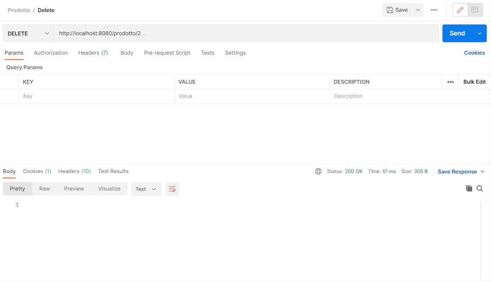

# Esame
Esame

###link repository
[spring start io] (https://github.com/francescacutrino/Esame.git)

###Immagini con gli esempi di query
1. Esempio di query per visualizzare tutti i prodotti.

2. Esempio di query per cercare i prodotti per id.
   

3. Esempio di query per aggiornare i prodotti. Ho utilizzato il metodo put.
   

4. Esempio di query per aggiungere un prodotto. Ho utilizzato il metodo post.
   

5. Esempio di query per cercare i prodotti per nome.
   

6. Esempio di query in cui applico il metodo Delete.
   

7. Caricamento di un file csv. Ho utilizzato il metodo post.
   

8. Esempio di query per la ricerca delle date di acquisto.
   

9. Esempio di query per la ricerca delle date di scadenza.
